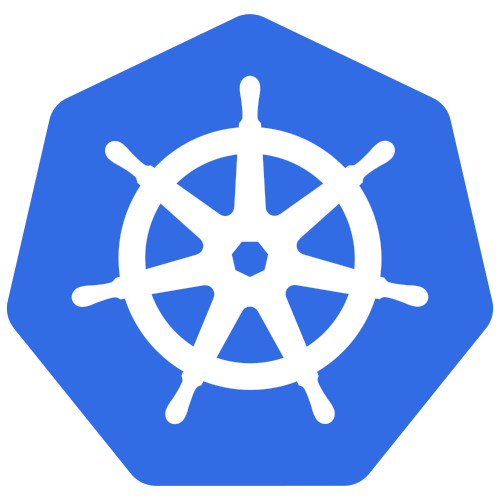

# <center>Kubernetes Overview</center> 
Kubernetes (K8) is a container orchestration service used to automate the deployment, scaling, and management of containerized applications. In the examples directory, there are sample yaml files for different objects such as Deployment, Pods, ReplicaSets, etc.
For the official documentation, go to the [Kubernetes](https://kubernetes.io/) website.

## Kubectl
Here are some useful commands for the kubectl:
```
kubectl apply -f <FILENAME>.yaml
```
```
kubectl create -f <FILENAME>.yml
```
Retrieve the status of the Pods:
```bash
kubectl get pods
```
Label nodes with key-value pair:
```bash
kubectl label nodes <NODE_NAME> <LABEL_KEY>=<LABEL_VALUE>
```
Filter by label:
```bash
kubectl get nodes --selector <LABEL_KEY>=<LABEL_VALUE>
```
```bash
kubectl scale replicas=<UPDATED_NUMBER> -f <FILENAME>.yml
// Or the command below (need to update number in )
kubectl replace -f <FILENAME>.yml
```
```bash
kubectl rollout history deployment/<NAME_OF_DEPLOYMENT>
```
## Services
Services is an object can help connect applications with each other within the cluster. It can support various use cases such as listening on a port on the node and forwarding requests to a port running the application. There are different service types such as:
1. NodePort
2. ClusterIP    
3. LoadBalancer
### NodePort
NodePort exposes the service on a static port on each node of the cluster. NodePort has three key components: NodePort, Service Port, and Target Port. It has a valid range from 30000 to 32767.

For example, if there are three Pods with the same label and the selector contains these labels, the service will look and matches the Pods with the right label. 

The service will then automatically select all the three Pods as endpoints to forward the external request.
```yaml
spec:
  # Specify the type of service being created e.g Cluster IP, LoadBalancer, NodePort
  type: NodePort
  # Rest of the configuration
```
### Cluster IP
ClusterIP is used for exposing services only within the cluster. It helps to group the Pods together in a suitable group e.g frontend, backend, data-store.
```yaml
spec:
  # Specify the type of service being created e.g Cluster IP, LoadBalancer, NodePort
  type: ClusterIP
  # Rest of the configuration
```
### LoadBalancer
LoadBalancer is used to expose services externally and typically works with cloud providers that support load balancers (e.g., AWS ELB, GCP Load Balancer). For example, if users want to access the application through a DNS link such as http://myapp.com, a LoadBalancer can be configured allow this.
```yaml
spec:
  # Specify the type of service being created e.g Cluster IP, LoadBalancer, NodePort
  type: LoadBalancer
  # Rest of the configuration
```
## Networking
In Kubernetes, each Pod is assigned an internal IP address within a network. Best practices:
- All containers/Pods can communicate to one another without NAT
- All nodes can communicate with all containers and verse-versa without NAT
Also, the IP addresses are NOT static.
## ReplicaSet
Simply, a replica set is a tool which helps run multiple instances of Pods at a given time, thus ensuring that a certain number is always running. If any Pods experience a failure, a ReplicaSet can provision a new Pod. 
## Deployment
In a production environment, a deployment object in K8 can help deploy and manage the running Pods instances. It is a higher-level resource that manages ReplicaSets and provides features for updating and scaling applications while ensuring zero-downtime deployments.
```yaml
apiVersion: apps/v1
Kind: Deployment
spec:
  # Rest of the config
```
## Labels and Selectors
Labels are key-value pairs that are attached to objects such as Pods. They are used to identify and select objects. For example, if there are three Pods with the same label and the selector contains these labels, the service will look and matches the Pods with the right label.

This is useful for grouping objects together. For example, if the user wants to deploy Pods on certain Nodes, they are able 
to do so. 
```yaml
selector:
  matchLabels:
    app: nginx
```
### Rollout and Deployment Strategy
When an application is being updated, a new rollout is pushed out revision is created. This enables users to be able to rollback their changes if there is an error in the deployment process. To see the status of the rollout: the following command:
```
kubectl rollout status deployment/<NAME_OF_DEPLOYMENT>
```
The deployment strategy specifies how the rollout will occur. There are the following:
1. Recreate: This will destroy all running instances and then re-create new instances 
2. Rolling-Update: This will bring down one instance at a time 
Under the hood: a new replica set is created and the containers will be deployed there while the old replica set is removed. 
